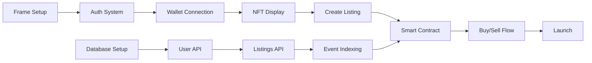

# FC NFT Exchange MVP Development Plan

## Overview
This plan outlines the essential tasks and their order for building the MVP of the FC NFT Exchange - a Farcaster Frame-based NFT marketplace on Base L2, using a unified Hono + Vite architecture with Custom Elements for interactivity.

## Architecture Overview
- **Full Stack**: Cloudflare Workers + Hono (server) with Vite (bundler)
- **UI Components**: Custom Elements for interactive features, CSS Modules for styling
- **Frame Integration**: Farcaster Frame SDK with server-side rendering
- **Database**: Cloudflare D1
- **Smart Contract**: To be deployed on Base L2
- **Storage**: Cloudflare R2 for images
- **Package Manager**: Bun
- **Development**: Single command for `wrangler dev` + Vite build watch

## Phase 1: Foundation Setup (Week 1)

### Project Setup (Day 1)
1. **Initialize Unified Hono + Vite Project**
   ```bash
   bun init -y
   bun add hono @farcaster/frame-sdk
   bun add -D wrangler vite @cloudflare/workers-types
   ```
   - Configure `wrangler.toml` with assets directory
   - Set up `vite.config.js` for client-side bundling
   - Create unified dev command in package.json:
   ```json
   "scripts": {
     "dev": "concurrently \"wrangler dev\" \"vite build --watch\"",
     "build": "vite build && wrangler deploy"
   }
   ```

2. **Create Base Hono Application Structure** (Day 1)
   ```javascript
   // src/index.js - Hono worker entry
   import { Hono } from 'hono'
   import { renderer } from 'hono/jsx-renderer'
   import { serveStatic } from 'hono/cloudflare-workers'
   
   const app = new Hono()
   
   // Serve static assets from Vite build
   app.use('/assets/*', serveStatic({ root: './dist' }))
   
   // JSX renderer for server-side rendering
   app.use('*', renderer(({ children, title }) => {
     return (
       <html>
         <head>
           <title>{title || 'FC NFT Exchange'}</title>
           <meta name="fc:frame" content='{...}' />
           <script type="module" src="/assets/main.js"></script>
           <link rel="stylesheet" href="/assets/style.css" />
         </head>
         <body>{children}</body>
       </html>
     )
   }))
   ```

3. **Set Up Custom Elements Architecture** (Day 1-2)
   ```javascript
   // src/client/main.js - Client entry point
   import * as frame from '@farcaster/frame-sdk'
   import './components/nft-grid.js'
   import './components/listing-form.js'
   import './components/activity-feed.js'
   
   // Initialize Frame SDK
   const init = async () => {
     const context = await frame.sdk.context
     // Set up global state management
     window.frameContext = context
     await frame.sdk.actions.ready()
   }
   
   init()
   ```

4. **Set Up D1 Database** (Day 2)
   - Create database schema from INITIAL_PRD.md
   - Initialize D1 database with Wrangler
   - Create migration scripts
   - Test database connections

### Core Development Tasks

1. **Implement User Authentication** (Day 2-3)
   ```bash
   bun add @farcaster/quick-auth
   ```
   - Create `/api/auth/quickAuth` endpoint
   - Implement JWT verification in Hono middleware
   - Create authentication Custom Element:
   ```javascript
   // src/client/components/auth-button.js
   class AuthButton extends HTMLElement {
     async connectedCallback() {
       const { token } = await frame.sdk.experimental.quickAuth()
       // Store token and update UI
     }
   }
   customElements.define('auth-button', AuthButton)
   ```

2. **Design System with CSS Modules** (Day 3)
   - Extract styles from HTML mockups into CSS Modules
   - Create base styles and component styles:
   ```css
   /* src/client/styles/components/nft-card.module.css */
   .card {
     border-radius: 8px;
     background: var(--card-bg);
   }
   ```
   - Set up CSS Module processing in Vite

3. **NFT API Integration** (Day 3-4)
   - Set up Alchemy API credentials
   - Implement `/api/users/:address/nfts` endpoint in Hono
   - Create NFT display Custom Element

4. **Tab Navigation System** (Day 4-5)
   - Implement tab-based navigation without page refreshes
   - Create Custom Elements for each tab:
     - `<browse-tab>` - NFT marketplace listings
     - `<create-tab>` - Create new listing
     - `<activity-tab>` - User activity and history

## Phase 2: Core Marketplace Features (Week 2)

### Unified Implementation Tasks

1. **Server-Side Rendering + Custom Elements** (Day 1-2)
   ```javascript
   // Hono route with SSR
   app.get('/', async (c) => {
     const listings = await c.env.DB.prepare(
       'SELECT * FROM listings WHERE sold_at IS NULL LIMIT 20'
     ).all()
     
     return c.render(
       <div class="app">
         <nav-tabs active="browse"></nav-tabs>
         <nft-grid initial-data={JSON.stringify(listings.results)}></nft-grid>
       </div>,
       { title: 'Browse NFTs' }
     )
   })
   ```
   
   ```javascript
   // Client-side Custom Element
   class NFTGrid extends HTMLElement {
     connectedCallback() {
       const initialData = JSON.parse(this.getAttribute('initial-data') || '[]')
       this.render(initialData)
       // Hydrate with interactivity
     }
   }
   ```

2. **Listings API + UI Integration** (Day 2-3)
   - Implement Hono API endpoints:
     - `GET /api/listings` - paginated active listings
     - `GET /api/listings/:id` - single listing details
     - `POST /api/listings` - create listing
   - Create listing Custom Elements with CSS Modules

3. **Transaction Management** (Day 3-4)
   - Create transaction utility module
   - Implement approval + action pattern
   - Handle Frame SDK wallet interactions:
   ```javascript
   class TransactionManager {
     async buyListing(listingId, price) {
       const accounts = await frame.sdk.wallet.ethProvider.request({
         method: 'eth_requestAccounts'
       })
       // Approve USDC + Buy NFT
     }
   }
   ```

4. **Event Indexing System** (Day 4-5)
   - Create scheduled worker for blockchain indexing
   - Implement event parsing in Hono worker:
   ```javascript
   export default {
     async scheduled(event, env, ctx) {
       // Index smart contract events
     },
     fetch: app.fetch // Main Hono app
   }
   ```

5. **Image Upload with R2** (Day 5)
   - Set up R2 bucket in wrangler.toml
   - Create `/api/images/upload` endpoint
   - Implement image optimization
   - Integrate with listing creation flow

## Phase 3: Smart Contract Integration (Week 3)

### Unified Implementation Tasks

1. **Deploy Smart Contract** (Day 1)
   - Deploy marketplace contract to Base
   - Verify contract on BaseScan
   - Update environment variables in wrangler.toml

2. **Complete Tab Implementation** (Day 2-3)
   - **Browse Tab**: NFT grid with server-side data
   - **Create Tab**: Form with NFT selector
   - **Activity Tab**: User history and stats
   - All using Custom Elements + CSS Modules:
   ```javascript
   class CreateTab extends HTMLElement {
     async loadUserNFTs() {
       const accounts = await frame.sdk.wallet.ethProvider.request({
         method: 'eth_requestAccounts'
       })
       const response = await fetch(`/api/users/${accounts[0]}/nfts`)
       const { nfts } = await response.json()
       this.renderNFTSelector(nfts)
     }
   }
   ```

3. **Buy/Sell Flow Implementation** (Day 3-4)
   - USDC approval Custom Element
   - Purchase confirmation UI
   - Success/failure states with CSS Modules
   - Transaction status tracking

4. **Activity Feed Implementation** (Day 4-5)
   - Server-side activity rendering
   - Client-side real-time updates
   - Activity Custom Element with filtering:
   ```javascript
   class ActivityFeed extends HTMLElement {
     constructor() {
       super()
       this.pollInterval = null
     }
     
     connectedCallback() {
       this.startPolling()
     }
     
     async startPolling() {
       this.pollInterval = setInterval(async () => {
         const activity = await fetch('/api/activity')
         this.updateFeed(await activity.json())
       }, 5000)
     }
   }
   ```

## Phase 4: Polish & Launch Prep (Week 4)

### Final Implementation Tasks

1. **Performance Optimization** (Day 1-2)
   - Optimize Vite bundle size
   - Implement proper code splitting
   - Add service worker for offline support
   - Optimize Custom Element initialization

2. **Production Build Setup** (Day 2-3)
   ```json
   // package.json
   {
     "scripts": {
       "dev": "concurrently \"wrangler dev\" \"vite build --watch\"",
       "build": "vite build && wrangler deploy --minify",
       "preview": "wrangler dev --local"
     }
   }
   ```
   - Configure production environment
   - Set up monitoring

3. **Frame Testing & Submission** (Day 3-4)
   - Test Frame in Warpcast with production URL
   - Create preview images
   - Submit to Frame directory
   - Ensure all Custom Elements work in Frame context

4. **Launch & Monitor** (Day 5)
   - Deploy to production
   - Monitor performance and errors
   - Gather user feedback
   - Plan iterations

## Critical Path Dependencies



## Project Structure

```
/
├── src/
│   ├── index.js          # Hono worker entry
│   ├── client/
│   │   ├── main.js       # Client entry (Frame SDK init)
│   │   ├── components/   # Custom Elements
│   │   │   ├── nft-grid.js
│   │   │   ├── listing-form.js
│   │   │   ├── activity-feed.js
│   │   │   └── nav-tabs.js
│   │   ├── styles/       # CSS Modules
│   │   │   ├── base.css
│   │   │   └── components/
│   │   └── utils/
│   │       └── transactions.js
│   └── server/
│       ├── auth.js       # Quick Auth middleware
│       ├── db.js         # D1 queries
│       └── indexer.js    # Blockchain indexer
├── public/               # Static assets
├── dist/                 # Vite build output
├── package.json
├── vite.config.js
└── wrangler.toml
```

## MVP Success Criteria

### Must Have
- [ ] Frame loads in Warpcast with proper metadata
- [ ] Users can authenticate with Farcaster Quick Auth
- [ ] Server-side rendering with client-side hydration
- [ ] Custom Elements for all interactive features
- [ ] CSS Modules for consistent styling
- [ ] Users can view and list their NFTs
- [ ] Users can buy listed NFTs
- [ ] Transactions settle on Base L2
- [ ] Single dev command runs both wrangler and vite

### Nice to Have
- [ ] Progressive enhancement (works without JS)
- [ ] Offline support with service worker
- [ ] Advanced filtering and search
- [ ] Social sharing features

## Development Guidelines

### Architecture Principles
- Server-side rendering for initial load
- Custom Elements for client-side interactivity
- CSS Modules for component-scoped styling
- Progressive enhancement approach
- Frame SDK for all Farcaster interactions

### Custom Elements Best Practices
```javascript
// Good: Self-contained with clear lifecycle
class NFTCard extends HTMLElement {
  constructor() {
    super()
    this.attachShadow({ mode: 'open' })
  }
  
  connectedCallback() {
    this.render()
    this.attachEventListeners()
  }
  
  disconnectedCallback() {
    this.cleanup()
  }
}
```

### CSS Modules Usage
```css
/* components/nft-card.module.css */
.card {
  composes: shadowSmall from '../base.css';
  background: var(--surface-color);
}

.price {
  font-weight: 600;
  color: var(--primary-color);
}
```

### Security
- Input validation in Hono middleware
- SQL injection prevention with prepared statements
- XSS protection through proper escaping
- Secure JWT handling with Quick Auth
- Frame context validation

## Development Setup

### Prerequisites
```bash
# Install bun
curl -fsSL https://bun.sh/install | bash

# Clone and setup
git clone <repo>
cd nft-exchange
bun install

# Configure environment
cp wrangler.example.toml wrangler.toml
# Add your Cloudflare account ID and API keys
```

### Required Services
1. Cloudflare account (Workers, D1, R2)
2. Alchemy API key for Base mainnet
3. Farcaster Quick Auth setup
4. Domain for production

### Development Commands
```bash
# Start development (runs wrangler + vite)
bun run dev

# Create D1 database
wrangler d1 create nft-exchange

# Run migrations
wrangler d1 execute nft-exchange --file=./schema.sql

# Deploy to production
bun run build
```

## Key Technical Decisions

### Why Hono + Vite?
- Single deployment unit to Cloudflare Workers
- Server-side rendering for fast initial load
- Vite for optimal client-side bundling
- Built-in asset serving with Cloudflare Workers

### Why Custom Elements?
- Native browser API, no framework needed
- Perfect for progressive enhancement
- Each component manages its own lifecycle
- Works great with server-side rendering

### Why CSS Modules?
- Scoped styles without runtime overhead
- Better than inline styles for performance
- Maintains design system consistency
- Easy to extract from existing mockups

### Single Dev Command Benefits
- Simplified developer experience
- Automatic rebuilds on file changes
- Unified logging and error handling
- Faster iteration cycles

This architecture provides optimal performance for a Frame-based application while maintaining developer productivity and code quality.